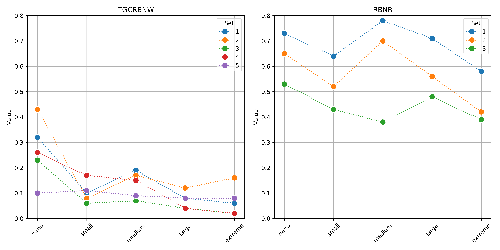
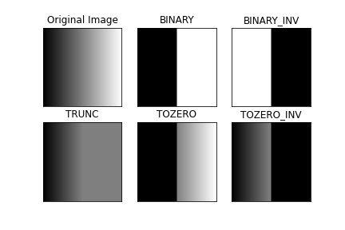

# Assessment and implementation of an object detection framework for bib number recognition during sports events
Using machine learning algorithms, including Ultralytics, Torch, Tensorflow, OpenCV and NIVIDIA's CUDA to detect numbers on racing bibs found in natural image scene. 


## Overview and Background
Detecting and recognizing Racing Bib Numbers (RBN) entails the challenging tasks of locating the bib attached to a person within a natural scene and deciphering the text inscribed on the bib itself in order to identify the runner. This involves intricate steps such as identifying the bib's area on a person and then interpreting the numerical content. Drawing from prior research and practical experience, this project employs a functional Convolutional Neural Network (CNN) to effectively identify race bib numbers in static images.

This repository delves into the exploration of Convolutional Neural Networks (CNN), particularly focusing on the utilization of Ultralytics (in particular YOLO module) and OpenCV, to discern Racing Bib Numbers (RBNR) within natural image settings. By capitalizing on publicly available and labeled datasets sourced from earlier investigations (refer to the reference section for additional details), results have been achieved in terms of accuracy and prediction time.


## Table of Contents
```
BibObjectDetection
|__ images
|   |__ results_accuracy.png 
|   |__ threshold.jpg
|   |__ yolo_application.png
|__ weights
|   |__ BDBD
|   |   |__ yolov8l.pt
|   |   |__ yolov8m.pt 
|   |   |__ yolov8s.pt 
|   |   |__ yolov8n.pt 
|   |__ People
|   |   |__ yolov8l.pt
|   |   |__ yolov8m.pt 
|   |   |__ yolov8s.pt 
|   |   |__ yolov8n.pt 
|   |__ SVHN
|   |   |__ yolov8l.pt
|   |   |__ yolov8m.pt 
|   |   |__ yolov8s.pt 
|   |   |__ yolov8n.pt 
|__ labels
|   |__ labels_test
|   |   |__ all the labels in txt format
|   |__ labels_train
|   |   |__ all the labels in txt format
|__ src
    |__ create_csv.py
    |__ create_yaml.py
    |__ data_augmentation.py
    |__ image_prediction.py
    |__ move_png_files.py
    |__ train.py
    |__ video_prediction.py
README.md
requirements.txt
```

## Getting started

### Resources used
A high-performance desktop computer equipped with an Intel Core i9-10900 CPU and a powerful NVIDIA GeForce RTX 3090 GPU (10,496 CUDA cores, 328 Tensor cores, 24GB RAM) graphic card has been used. This robust system efficiently managed the intense computation required for training. Specifically, the training process exclusively used the GPU's parallel processing capabilities for significant speed optimization, reducing training time to approximately 3 hours per model for bib detection, and higher time for number detection (from half a day, to two days for the extreme model).

### Installing
The project is deployed in a local machine, so you need to install the next software and dependencies to start working:

1. Create and activate the new virtual environment for the project

```bash
conda create --name bib_detection python=3.10
conda activate bib_detection
```

2. Clone repository

```bash
git clone https://github.com/rafamartinezquiles/yolov8-bib-recognition.git
```

3. In the same folder that the requirements are, install the necessary requirements

```bash
pip install -r requirements.txt
```

4. In addition to the existing requirements, PyTorch needs to be installed separately. Due to its dependence on various computational specifications, it's essential for each user to install it individually by following the provided link. [PyTorch](https://pytorch.org/). By default, training is conducted on the GPU. If a GPU is unavailable, we switch to CPU training, which, though slower, still allows for model training.

### Setup
It is worth noting that the "bib detection big data" provides functionality to download it in YOLOv8 format, which is recommended. Meanwhile, for SVHN data, we would need to download it in format 1 for both the training set and the test set. However, the latter do not come in the desired YOLOv8 format, so preprocessing would be required.

1. Retrieve the BDBD Dataset in YOLOv8 format from the provided [link](https://universe.roboflow.com/hcmus-3p8wh/bib-detection-big-data/dataset/3/download/yolov8). Download it as a zip file and ensure to place it within the main folder of the cloned repository named yolov8-bib-recognition.


2. Inside the cloned repository, execute the following command in order to download the SVHN dataset necessary for the project elaboration.

```bash

```

1. Access the directory where the compressed folders associated with the SVHN dataset have been downloaded and execute the following commands to decompress these folders

```bash
tar -xzvf train.tar.gz
tar -xzvf test.tar.gz
```

2. Once the previous folders have been downloaded and unzipped, the next step is to transfer all images to a folder named "images." This is achieved by executing the following commands, where the source path is designated as the first argument and the destination path is the same as the source path, with "/images" appended to ensure the images are saved there. This procedure is applied to both the train and test folders.

```bash
python move_png_files.py /path/to/train_folder/ /path/to/train_folder/images
python move_png_files.py /path/to/test_folder/ /path/to/test_folder/images
```

An example of how to use this would be as follows:

```bash
python move_png_files.py /home/rafa/Downloads/train/ /home/rafa/Downloads/train/images
python move_png_files.py /home/rafa/Downloads/test/ /home/rafa/Downloads/test/images
```

3. Within the "labels" directory, you'll encounter two subdirectories: "labels_train" and "labels_test." Place these folders inside the "train" and "test" directories, respectively, so that each contains both "images" and "labels" directories. To accomplish this, rename "labels_train" and "labels_test" to simply "labels" within their respective folders.

4. One notable aspect of YOLO is its dependency on a .yaml file to delineate the paths for both training data (images and labels) and testing, as well as the classes to be identified. To accomplish this, a Python script is executed, with parameters including the training and validation paths of the SVHN dataset. The script generates the required file in the designated location, considering that the other dataset contains all essential files.

```bash
python create_yaml.py /generic/path/to/where/train/and/test/folder/are
```

An example of how to use this would be as follows:

```bash
python create_yaml.py /home/rafa/Downloads/
```

## Training of neural networks
The training of the neural networks will be accomplished by executing the train.py file, passing a series of arguments that define the characteristics of the neural network. It's important to note that the training process entails two phases: initially, training the network responsible for detecting the bibs worn by each runner, followed by training to recognize the numbers within each bib. The arguments to be specified are:

- **data:** This parameter represents the path leading to the .yaml file associated with each dataset.
- **imgsz:** Refers to the image size utilized during training.
- **epochs:** Denotes the number of training epochs. The inclusion of the early stopping attribute allows for the termination of training if the model fails to demonstrate improvement after a specified number of epochs.
- **batch:** Specifies the batch size utilized during training.
- **name:** Represents the name assigned to the neural network.
- **model_size:** This parameter offers a selection of options ('n', 's', 'm', 'l', 'x') corresponding to different versions of YOLOv8 that can be trained.

```bash
python train.py --data /path/to/the/yaml_file/svhn.yaml --imgsz 640 --epochs 400 --batch 32 --name svhn_yolov8s --model_size s
```

In case of not having the necessary time or resources to train the neural networks, the weights of the neural networks are provided, except for the extreme version due to a higher weight than allowed.In case you want to use it, you must download it from the following [Link](https://upm365-my.sharepoint.com/:f:/g/personal/rafael_martinez_quiles_alumnos_upm_es/EglMEhA_I9pJgzHpK_QYVHgBIvmszjXRYUIuGxlIEJ-k9w?e=nVKcsS).

## Testing of neural networks
At this point, a difference will be made between the type of file with which the neural network test is to be performed. The extracted results were established for the set of images that appear in the data used; however, an additional code has been prepared to test the neural networks in video format and to extract bibs every a certain number of seconds, since in real time there are not enough resources.

### Image format
Utilizing the provided code dedicated to image prediction, upon specifying the desired paths and filenames instead of <people_model_path(.pt)>, <bib_model_path(.pt)>, <number_model_path(.pt)>, <image_folder>, and <output_csv>, we facilitate predictions on an entire image directory. The output log meticulously details the outcomes derived from executing a neural network model across diverse input image dimensions. Each segment of the log commences with comprehensive information regarding the input image size and the count of detected objects or classes. Subsequently, the log meticulously records time measurements in milliseconds for distinct phases of the inference pipeline: preprocessing, inference, and postprocessing. These precise time measurements serve to elucidate the computational efficacy of the model at varying processing stages. Moreover, the log captures scenarios where no objects were detected in specific images, denoted as "(no detections)". Furthermore, a CSV file encapsulating the predictions is automatically generated and stored at the designated path under the specified filename.

```bash
python image_prediction.py <people_model_path(.pt)> <bib_model_path(.pt)> <number_model_path(.pt)> <image_folder> <output_csv>
```

An example of how to use this would be as follows:

```bash
python image_prediction.py /home/rafa/Desktop/NEMO/YOLOv8s/data/yolov8s.pt /home/rafa/Desktop/best.pt /home/rafa/Desktop/NEMO/YOLOv8s/data/runs/detect/yolov8s_svhn/weights/best.pt /home/rafa/Desktop/NEMO/Datasets/Detection/RBNR_datasets/images/test /home/rafa/Desktop/NEMO/yolov8s.csv
```

### Video Format
This feature was incorporated into the project after to provide users with the capability to identify runners in both images and videos. It achieves this by extracting frames from the video at specified intervals. After the frames are extracted and stored in a folder, the existing procedure for identifying runners in images is applied. While real-time processing was contemplated, its implementation was deemed challenging due to computational resource constraints. For this, unlike the arguments to be inserted in the previous command, you should add the path where the video is placed and the time interval to be spent in the video between each of the frames.

```bash
python video_prediction.py <people_model_path(.pt)> <bib_model_path(.pt)> <number_model_path(.pt)> <video_path> <frame_interval> <output_csv>
```

An example of how to use this would be as follows:

```bash
python video_prediction.py /home/rafa/Desktop/NEMO/YOLOv8s/data/yolov8s.pt /home/rafa/Desktop/best.pt /home/rafa/Desktop/NEMO/YOLOv8s/data/runs/detect/yolov8s_svhn/weights/best.pt /home/rafa/Downloads/bib_segmentation.mp4 3 /home/rafa/Desktop/NEMO/yolov8s.csv
```

Executing this command will generate a folder containing each of the frames extracted from the video, alongside a CSV file containing the corresponding predictions for each frame. The terminal output resembles that obtained when making predictions on individual images.

## Extraction of evaluation metrics
This section is dedicated to extracting evaluation metrics for the RBNR Dataset, as the alternative evaluation method requires special permissions. After generating the CSV file containing predictions for the RBNR's subsets, we proceed to compare the actual values with the predicted ones to determine True Positives (TP), False Positives (FP), and False Negatives (FN). In this context:

- True Positive (TP): Represents correct detections of numbers within the bibs of each runner.
- True Negative (TN): Not applicable in object detection, as regions outside annotations aren't explicitly labeled.
- False Positive (FP): Occurs when incorrect detections are made, including cases where objects other than bibs are mistakenly identified. Since our process focuses solely on detecting people, bibs, and numbers, this latter scenario results in FP = 0.
- False Negative (FN): Refers to rows present in the original CSV but not found in the predicted CSV. This happens when a bib that should be detected in a given image is missed during detection.

If the RBNR Dataset has not been downloaded, it should be obtained to extract evaluation metrics for the trained models.

1. First, access the location where the compressed data is located, then execute the following command in your computer's terminal.

```bash
unzip RBNR_Datasets.zip
```

2. Run the following command to generate a CSV file for each subset (subfolder) of the downloaded dataset. These CSV files will be used to extract metrics against the predictions made. Ensure to specify the path where the uncompressed files are located when executing the command.

```bash
python create_csv.py path/to/the/unzip_folder
```

An example of how to use this would be as follows:

```bash
python create_csv.py /home/rafa/Downloads/datasets
```

3. Finally, in order to calculate all the necessary variables for the metrics calculation, we proceed to execute the code "calculate_metrics.py" where we have to pass as arguments the csv with the predictions and the original csv and it will return on the screen the 4 necessary variables.

```bash
python calculate_metrics.py /path/to/predicted.csv /path/to/original.csv
```

An example of how to use this would be as follows:

```bash
python calculate_metrics.py /home/rafa/Desktop/NEMO/set_1.csv /home/rafa/Downloads/RBNR_Datasets/datasets/set1_org/set1_org.csv
```

4. Once those values are available, metrics (precision, recall, F1-score, accuracy and sensitivity) can be calculated to assess the performance of the trained model. Depending on the preferences, formulas can be applied accordingly.

## Additional task - Data augmentation
To enhance the training dataset for neural networks, data augmentation can be employed. This process involves artificially generating new data from existing data, primarily to facilitate the training of new machine learning (ML) models. In this case, the following techniques have been used on the original images:

- **THRESH_BINARY:** This method sets pixel values above a certain threshold to a maximum value (255 in this case) and values below the threshold to zero. It essentially creates a binary image where pixels are either fully black or fully white.
- **THRESH_BINARY_INV:** Similar to THRESH_BINARY, but it inverts the binary image. Pixels with values above the threshold become black (0), and pixels below the threshold become white (255).
- **THRESH_TRUNC:** This method truncates pixel values above the threshold to the threshold value itself (255 in this case). Pixels below the threshold remain unchanged. It essentially clips the pixel values above the threshold.
- **THRESH_TOZERO:** Pixels below the threshold are set to zero, and pixels above the threshold remain unchanged.
- **THRESH_TOZERO_INV:** It is the inverse of THRESH_TOZERO. Pixels above the threshold are set to zero, and pixels below the threshold remain unchanged.

A summary of the above techniques can be visually observed in the following image.


To accomplish this task, the code in data_augmentation.py needs to be executed. It requires specifying the directory containing the image and label folders, as well as the directory where the new image and label folders will be saved.

```bash
python data_augmentation.py /path/to/input_folder /path/to/output_folder
```

An example of how to use this would be as follows:

```bash
python data_augmentation.py /home/rafa/Desktop/train/ /home/rafa/Desktop/Augmented/
```

## Data Details

### Training
- [Bib Detection Big Data](https://universe.roboflow.com/hcmus-3p8wh/bib-detection-big-data).
- [Street View House Numbers (SVHN) Dataset](http://ufldl.stanford.edu/housenumbers)

### Testing
- [Trans Gran Canaria Race Bib Number in the Wild (TGCRBNW)](http://hdl.handle.net/10553/112156).
- [Racing Bib Number Recognition (RBNR)](https://people.csail.mit.edu/talidekel/RBNR.html).

## References
- OpenCV: https://opencv.org/
- Ultralytics: https://github.com/ultralytics/ultralytics
- HCMUS. bib detection big data dataset. https://universe.roboflow.com/hcmus-3p8wh/bib-detection-big-data, jun 2023. visited on 2024-02-12
- Li Deng. The mnist database of handwritten digit images for machine learning research. IEEE Signal Processing Magazine, 29(6):141–142, 2012.
- Pablo Hernández-Carrascosa, Adrian Penate-Sanchez, Javier Lorenzo-Navarro, David Freire-Obregón, and Modesto Castrill ́on-Santana. Tgcrbnw: A dataset for runner bib number detection (and recognition) in the wild. In 2020 25th International Conference on Pattern Recognition (ICPR), pages 9445–9451, 2021.
- I.B. Ami, T. Basha, and S. Avidan. Racing bib number recognition. In Proc. BMCV,pages 1–10, 2012


